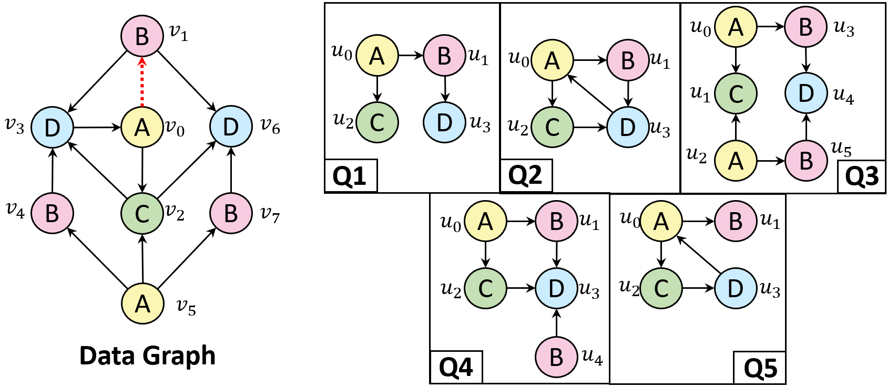

# Aquila

Aquila is a high-concurrency incremental graph query system which aims to solve concurrent mutilple graph queries in dynamic graph with performance isolation guarantee.

## Building Aquila
Aquila is developed based on [hiactor](https://github.com/alibaba/hiactor), a high-performance framework for building concurrent event-driven systems using C++. The following requirements should meet.

- C++ 17 support (gcc $\geq$ 9.0).
- Linux system.
- CMake $\geq$ 3.13.1.

Aquila is built and tested successfully on a Linux machine with Ubuntu 20.04, gcc 9.5.0 and CMake 3.28.3.

Note that Aquila is built upon hiactor, which served as a demo project in hiactor, and the **include**, **src** and **CMakeList.txt** should be modified according to the folders and files given in this repo. 

Clone hiactor and install necessary dependencies first with following commands.

```
$ git clone https://github.com/alibaba/hiactor.git
$ cd hiactor
$ git submodule update --init --recursive
$ sudo ./seastar/seastar/install-dependencies.sh
```
Next, replaced hiactor with corresponding folders and files. Specifically, with following commands:

```
$ git clone https://github.com/CrankyLover/Aquila.git
$ mv Aquila/aquila hiactor/demos/
$ mv Aquila/example hiactor/
$ mv Aquila/LSQB-QG hiactor/
$ rm -r hiactor/include
$ mv Aquila/include hiactor/
$ rm -r hiactor/src
$ mv Aquila/src hiactor/
$ rm hiactor/CMakeLists.txt
$ mv Aquila/CMakeListsInhiactor.txt hiactor/CMakeLists.txt
$ rm hiactor/demos/CMakeLists.txt
$ mv Aquila/CMakeListsIndemos.txt hiactor/demos/CMakeLists.txt
$ rm -r Aquila
```

Finally, build Aquila with following commands:
```
$ mkdir build
$ cd build
$ cmake -DCMAKE_INSTALL_PREFIX=/usr/local -DHiactor_CXX_DIALECT=gnu++17 \
    -DHiactor_TESTING=OFF -DSeastar_CXX_FLAGS="-DSEASTAR_DEFAULT_ALLOCATOR" ..
$ make
$ make install
```

## Run Aquila
Assume that the file path **"hiactor/build/demos/Aquila"** is located, the following command can be executed to run Aquila.
```
$ ./aquila -v vertex_file_path -e edge_file_path -u update_file_path -q query_folder_path \
    -core used_CPU_number -batch batch_size -iters max_iteration_times -show if_collect_result_number
```

- `vertex_file_path` represents the data graph which only contains vertices, each line represents a vertex with `v vertex_id vertex_label`, e.g.
```
v 0 1
v 1 3
v 2 5
```
- `edge_file_path` represents the data graph which only contains edges, each line represents an edge with `e source_vertex_id target_vertex_id edge_label`, e.g.
```
e 0 1 2
e 1 2 9
e 0 2 1
```

- `update_file_path` represents the update stream, each line represents an updated vertex with `v vertex_id vertex_label` or an updated edge with `e source_vertex_id target_vertex_id edge_label`, e.g.
```
v 3 4
e 3 2 11
```
- `query_folder_path` represents the query folder path, which contains a set of query graph files, each consists of multiple rows and each row represents a vertex or edge, just like shown in vertex file and edge file.

- `used_CPU_number` is the number of CPU that used in Aquila, which cannot surpass the max number of available CPU.
- `batch_size` is the batch size used in Aquila.
- `max_iteration_times` is the maximum batch number processed in Aquila.
- `if_collect_result_number` is **true** if Aquila collects the number of query results of each query graph and shows them, **false** otherwise.

The files  under `example/querygraphs` shows example querygraphs $Q_1$ to $Q_5$, `example/vertex.txt` shows the example graph only with vertices, `example/edge.txt` shows the example graph only with edges, `example/updatestream.txt` shows the update graph with vertices and edges. **This example is the same as the example used throughout our paper.**

An example to run Aquila is shown below:
```
$ ./Aquila -v vertex.txt -e edge.txt -u updatestream.txt -q querygraphs -used_CPU_number 1 -batch 1000 -iters 1 -show true
```

The example data graph and query graphs are shown below, note that we make mapping which maps uppercase letters of the label to Arabic numerals, which can be verified in the files in `example`.



## Benchmark

The benchmark we used including the datasets and LSQB-QG workloads can be found in another repo [LSQB-QG](https://github.com/CrankyLover/LSQB-QG).


